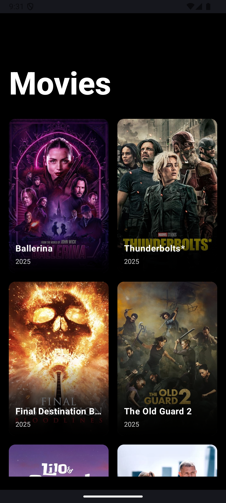
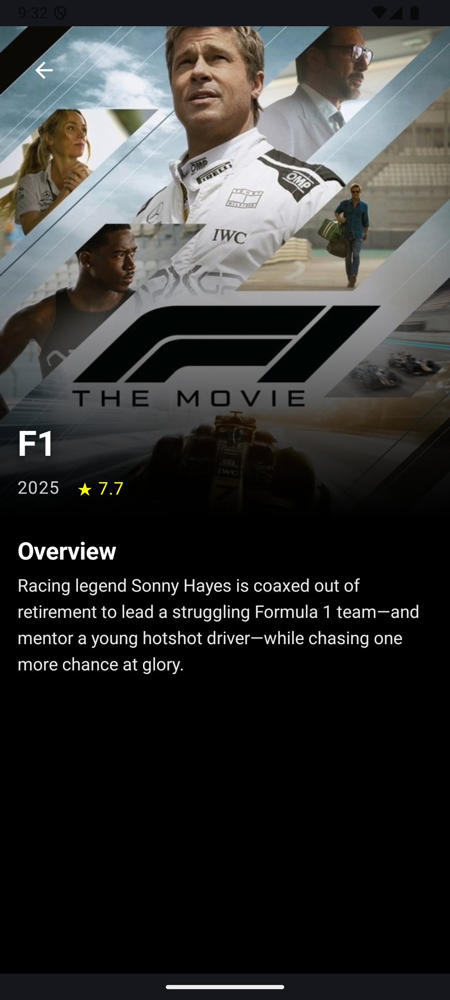
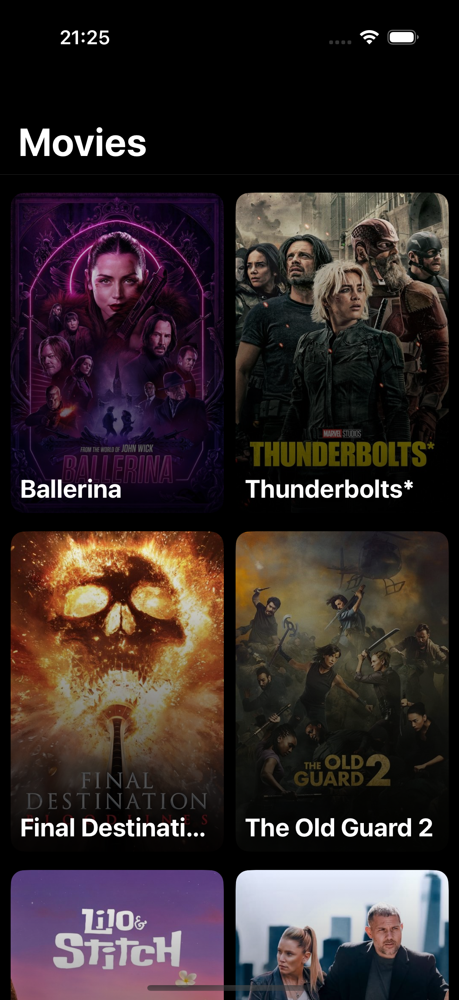
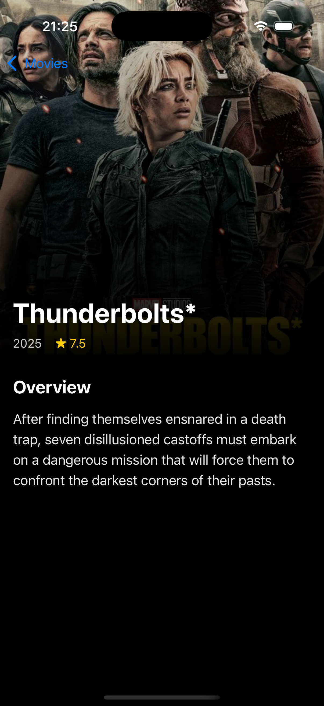

# 🎬 KMM Filmler Uygulaması

Bu proje, modern mobil geliştirme yaklaşımlarını sergilemek amacıyla oluşturulmuş bir filmler uygulamasıdır. Kotlin Multiplatform Mobile (KMM) kullanılarak **iş mantığı katmanı ortak bir kod tabanında** birleştirilmiş, arayüzler ise her platform için **%100 native** olarak **Jetpack Compose** ve **SwiftUI** ile geliştirilmiştir.

---

## 🌟 Genel Bakış

Uygulama, popüler filmleri listeleyen ve kullanıcıların film detaylarını görüntülemesine olanak tanıyan basit bir akışa sahiptir.  
Projenin temel amacı, **platformlar arası kod paylaşımının**, platforma özgü **UI/UX deneyiminden ödün vermeden** nasıl başarılabileceğini göstermektir.

### Android Ekran Görüntüleri

| Ana Ekran | Detay Ekranı |
|----------|--------------|
|  |  |

### iOS Ekran Görüntüleri

| Ana Ekran | Detay Ekranı |
|----------|--------------|
|  |  |

---

## 🏗️ Mimarî Yaklaşım: Clean Architecture

Proje, ölçeklenebilir, test edilebilir ve bakımı kolay bir yapı sağlamak amacıyla **Clean Architecture** prensipleri üzerine kurulmuştur.

- **Domain Katmanı**  
  Temel iş kurallarını ve modelleri içerir. Tamamen platformdan bağımsızdır. `shared` modülünde bulunur.

- **Data Katmanı**  
  The Movie DB API gibi veri kaynaklarını yönetir. Repository deseniyle domain katmanına veri sağlar.

- **Presentation Katmanı**  
  UI ve UI mantığı içerir. Her platform için ayrı ayrı (`androidApp`, `iosApp`) geliştirilmiştir.

---

## 🛠️ Kullanılan Teknolojiler

### 📦 Shared (Ortak) Modül

- **Kotlin & Coroutines** — Asenkron işlemler için  
- **Ktor Client** — HTTP istekleri için  
- **Kotlinx Serialization** — JSON parsing için

### 🤖 Android Uygulaması (`androidApp`)

- **Jetpack Compose** — Deklaratif UI  
- **MVVM** — Mimarî yapı  
- **Coil** — Resim yükleme ve önbellekleme  
- **Material 3** — Modern tasarım  
- **Navigation Compose** — Ekranlar arası geçişler

### 🍏 iOS Uygulaması (`iosApp`)

- **SwiftUI** — Modern deklaratif arayüz  
- **MVVM / ObservableObject** — UI State yönetimi  
- **Async/Await** — Asenkron işlemler  
- **NavigationStack** — Modern navigasyon (iOS 16+)

---

## ✨ Öne Çıkan Özellikler

- **Collapsing Toolbar** – Android'de kaydırma ile küçülen üst bar  
- **Infinite Scrolling** – Liste sonunda otomatik veri yükleme  
- **Modern UI** – Her iki platformda da akıcı animasyonlar  
- **Platforma Özgü Detaylar** – Örneğin iOS’ta yerel geri butonu desteği

